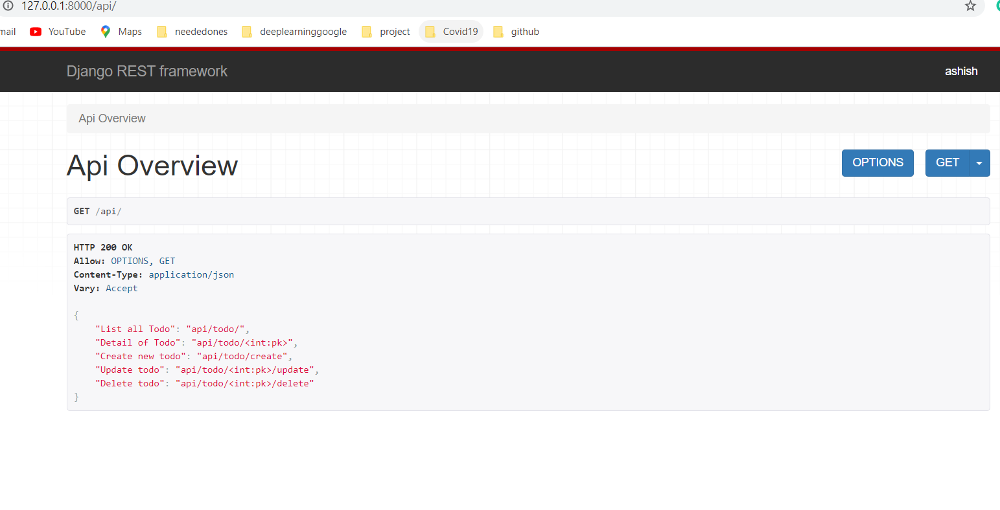

# Django-RESTAPI-Vue.js

## Steps Involved
<li>Created a RestAPI(todo)</li>
<li>Used Vue.js(for onepage CRUD operation) as frontend(CDN) to connect and work with the RESTapi</li>
<li>Ajax using fetch api</li>

## QuickStart
<li>Clone project:
<pre>git clone https://github.com/Aasess/ExpenseTracker.git</pre>
</li>
<li>Create a virtualenv and activate it:
<pre>python3 -m venv virtualenv
virtualenv\Scripts\activate.bat</pre>
</li>
<li>Install packages from requirements.txt file:
<pre>pip install -r requirements.txt</pre>
</li>
<li>Run migrations as:
<pre>python manage.py makemigrations
python manage.py migrate</pre>
</li>
<li>Start the development:
<pre>python manage.py runserver</pre>
</li>
<li>Run : http://127.0.0.1:8000/</li>

## API call
http://127.0.0.1:8000/api/

## Demo

